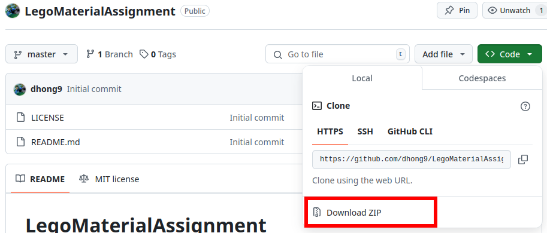
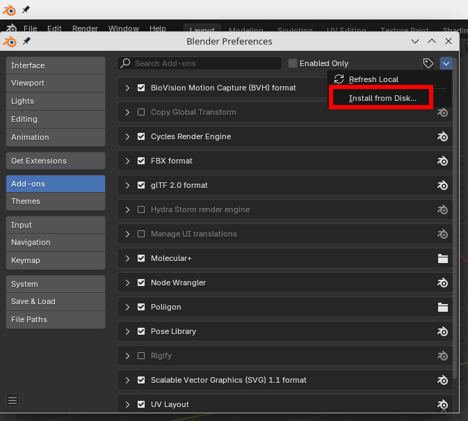
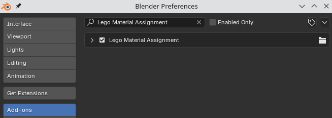

# LegoMaterialAssignment
Blender addon for assigning shiny Lego color to objects based on their color names

## Installation
Download the zip file by clicking the dropdown arrow next to the Code button. Do *not* unzip it!

From Blender, navigate to `Edit > Preferences > Add-ons`. Then, from the top-left corners' dropdown arrow, select "Install from Disk..." Select the zip folder that you downloaded.

You will see that your addon has installed and is automatically enabled.

## Usage
This addon assumes that your materials have a valid lego color name, such as `SOLID-BLACK`. They may contain a dot and anything after them such as `SOLID-BLACK.001`. To make your materials look like Lego, right click on your object in Object mode, and then select "Assign Lego Materials" from the object context menu.